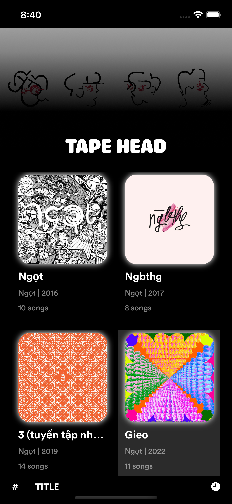
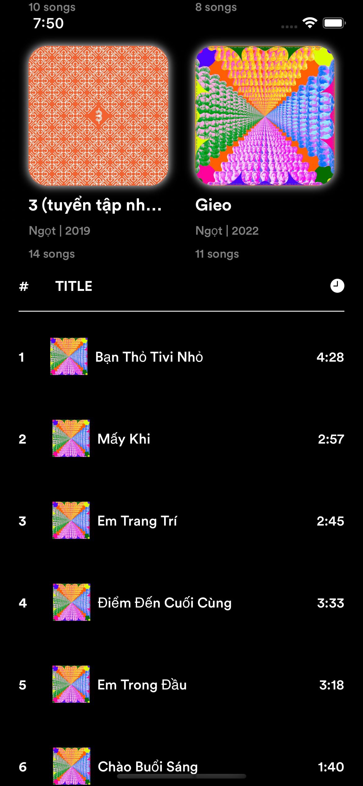
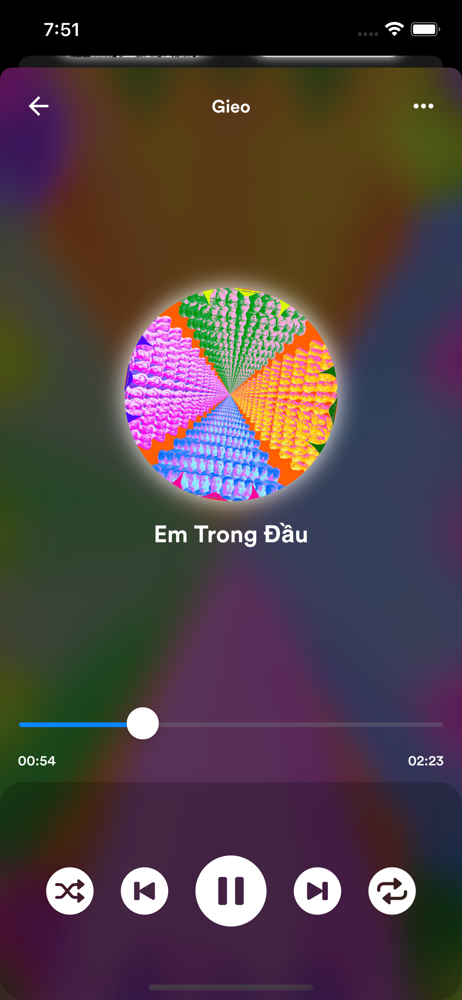
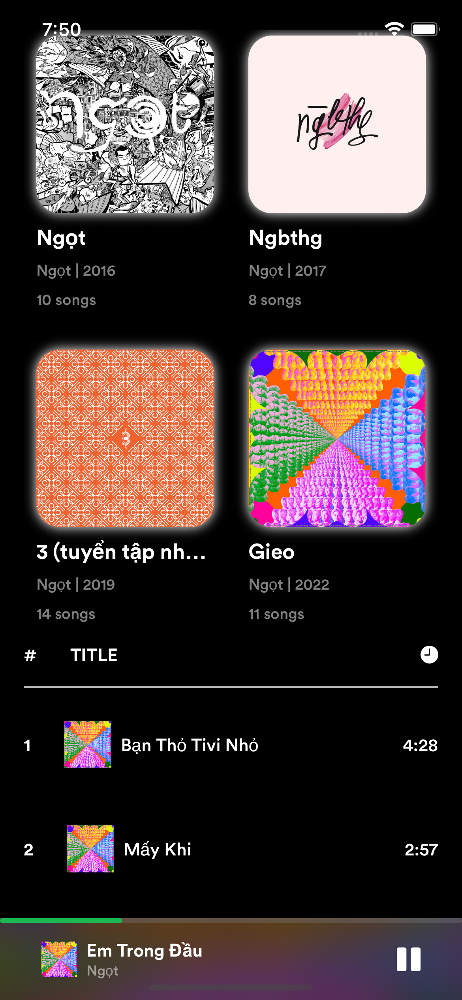

# Tape Head
> A music streaming app build with Swift & Firebase.

[![Swift Version][swift-image]][swift-url]
[![Build Status][travis-image]][travis-url]
[![License][license-image]][license-url]
[![codebeat-badge][codebeat-image]][codebeat-url]

Tape Head music streaming app displays albums with music tracks in those albums. The app will navigate to Player View to play the selected song with multiple options such as Play/Pause, Play Next, Play Previous, Slider Timeline, Shuffle, and On Repeat. The app also provide Mini Player View which allows users to interact with the player on main View as well.

## Showcase

 &nbsp;&nbsp;  &nbsp;&nbsp;  &nbsp;&nbsp; 


## Installation

Add this project on your `Package.swift`

```swift
import PackageDescription

let package = Package(
    dependencies: [
        .Package(url: "https://github.com/hlinh88/tape_head.git", majorVersion: 0, minor: 0)
    ]
)
```

## Usage example


```swift
import Project
let proj = Class(param: String?)
proj.run()
```


## Development setup

Describe how to install all development dependencies and how to run an automated test-suite of some kind. Potentially do this for multiple platforms.

```sh
make install
```

## Release History

* 0.2.1
    * Fix bugs and update project docs
* 0.2.0
    * Build MiniPlayer View
* 0.1.0
    * Build main UI and PlayerView UI
* 0.0.1
    * Work in progress

## Meta

**Nguyen Hoang Linh**

[https://github.com/hlinh88](https://github.com/hlinh88)

[swift-image]:https://img.shields.io/badge/swift-3.0-orange.svg
[swift-url]: https://swift.org/
[license-image]: https://img.shields.io/badge/License-MIT-blue.svg
[license-url]: LICENSE
[travis-image]: https://img.shields.io/travis/dbader/node-datadog-metrics/master.svg
[travis-url]: https://travis-ci.org/dbader/node-datadog-metrics
[codebeat-image]: https://codebeat.co/badges/c19b47ea-2f9d-45df-8458-b2d952fe9dad
[codebeat-url]: https://codebeat.co/projects/github-com-vsouza-awesomeios-com
